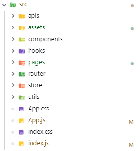

# 创建工程

```bash
npx create-react-app .
```

# 目录结构



# SCSS

```bash
 npm install sass -D
```

# AntD

```shell
npm install antd --save
```

# Router

```shell
npm i react-router-dom
```

# Craco

```shell

```

# Redux

```shell
npm i react-redux @reduxjs/toolkit
```

# Axios

```shell
npm i axios
```

# ClassNames

```shell
npm i classnames
```

# Dayjs

```shell
npm i dayjs
```

# UUID

```
npm i uuid
```

# Lodash

```shell
npm i lodash
```

# Echarts

```shell
npm i echarts
```

# normalize.css

```shell
npm install normalize.css
```

# antd-style moment

```shell
npm i antd-style
npm install moment
```
